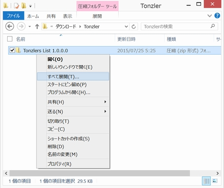
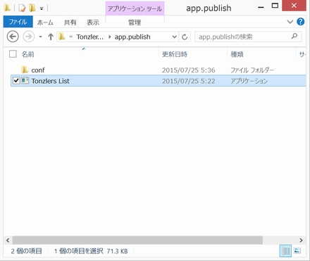
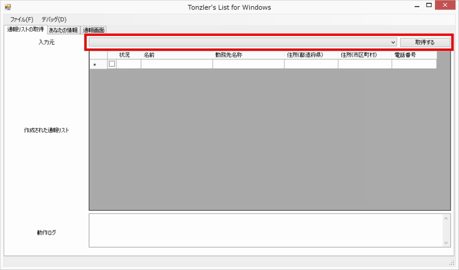
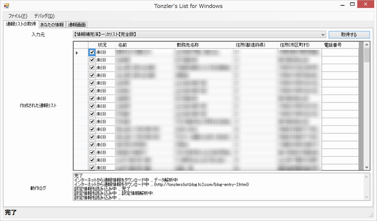
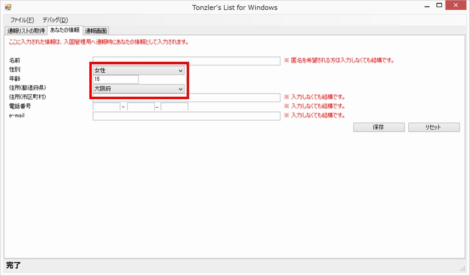
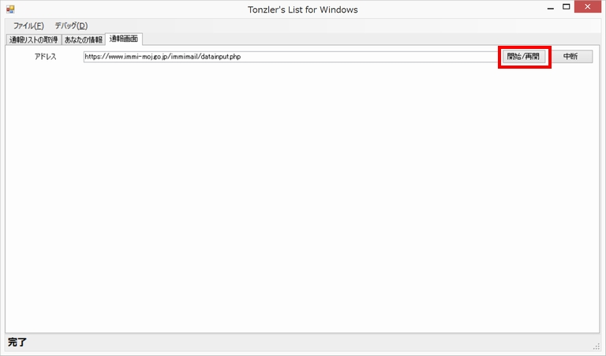
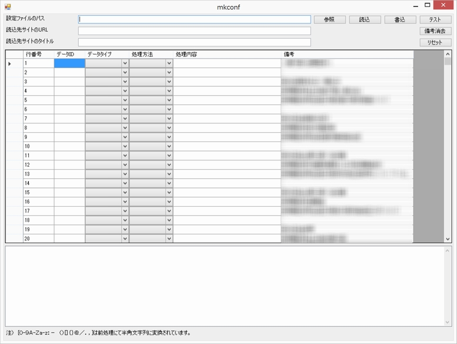

# Tonzler's List for Windows
## 本ソフトウェアの概要
このソフトウェアは tonzlerslist.blog.fc2.com に公開されている情報をもとに，不法残留の疑いがある者に関する情報提供作業を自動化します。

このソフトウェア自身は不法残留の疑いがある者に関する情報を含んでおりませんが， tonzlerslist.blog.fc2.com に公開されている情報をダウンロード・解析し，情報提供フォームへの入力・送信を自動化する機能が備わっています。

以下に示す，「操作方法について」に記載された手順を踏むことにより，tonzlerslist.blog.fc2.comに記載された不法残留の疑いがある者について，入国管理局へ「不法滞在の可能性」を通報動機として，その者が働いている場所の情報を提供することとなります。

## ダウンロード
以下のリンクより，ファイルをダウンロードすることができます。

[実行ファイル](http://github.com/tonzler/list/blob/master/tonzlerslist_1.0.0.0_release.zip)

[ソースコード](http://github.com/tonzler/list/blob/master/tonzlerslist_1.0.0.0_src.zip)

## 操作方法について
### 1.ソフトウェアの起動
ソフトウェアはZIP形式で圧縮された状態で配布されていますので，ダウンロード完了後はZIPファイルを解凍してください。

解凍するには，ダウンロードしたファイルを右クリックし，「すべて展開」をクリックしてください。画面の指示に従い，ファイルを解凍することができます。

解凍後は，app.publishフォルダ内のTonzlers List (Tonzlers List.exe) をダブルクリックして起動してください。

### 2.不法残留者情報の取得
ソフトウェアを起動したら，「通報リストの取得」タブの「入力元」から，「【情報補完済】一次リスト【完全版】 」を選択します。

選択後，「取得する」ボタンをクリックすると，自動的に通報リストがダウンロードされます。

### 3.あなたの情報の入力
次に，「あなたの情報」タブを開いてください。

ここへ，情報提供時に”あなたの情報”へ入力したい情報を入力してください。

**匿名を希望される場合は，名前や住所を入力する必要はありませんが，「性別・年齢・都道府県」については入力してください。**

なお，保存ボタンを押すと入力情報がファイルに保存され，次回起動時に自動で読み込むようになります。

### 4.情報提供の実施
次に，「通報画面」タブを開いてください。

「開始/再開」ボタンをクリックすると，通報リストにある情報を自動入力＆送信することができます。

(通報リストのうち，チェックボックスが選択されている項目が自動入力されます。)

## その他の情報
### 開発環境
開発には[Visual Studio Community 2013](https://www.visualstudio.com/ja-jp/downloads/download-visual-studio-vs#)を使用しています。(無料です)

開発言語はC#であり.Net Framework 4.5を使用しています。

Windows7, Windows8で動作確認を行っています。

### 解析用設定ファイルについて
今回のリリースにあたり，tonzlerslist.blog.fc2.com に公開されている情報の解析用設定ファイルを作成しております。

このファイルは app.publish/conf/ 以下に保存することで，「通報リストの取得」タブの「入力元」コンボボックスに列挙される仕組みとなっております。

また，このファイルの読み込み・保存・編集を行うためのツールを，「メニュー」→「デバッグ」→「Make Config File」から起動することが可能です。

このツール画面を開いた初期状態において，備考列には前画面の「取得する」ボタンでダウンロードしたHTMLのうち，本文の部分に当たる要素のinnerTextを1行ごとに分割したものが入力されています。

また，ツール画面中の「テスト」ボタンは，備考列のデータを入力元データとして，処理が適切に行われているかを確認するものになっています。

従って，新たに別のページに対する解析用設定ファイルを作成する場合は，

1. 設定ファイルのパスに新たな設定ファイル名を入力
2. 読込先サイトのURL,タイトルを入力して「書込」ボタンをクリック
3. ソフトウェアを再起動し，新規作成した設定ファイルを選択し「取得する」ボタンをクリックする。
4. サイトのデータがダウンロードされるので，Make Config Fileツールを起動する。
5. 備考欄に読み込まれたデータがあるのでこれをすべて選択しコピー(Ctrl+C)する。
6. 2.で作ったファイルを読み込む。
7. 備考欄を選択し，先ほどコピーしたデータを貼り付ける。(Ctrl+V)
8. データID,データタイプ,処理方法,処理内容を入力して，新たな解析条件を作成する。※データタイプ,処理方法は現状RegExpしか使用していません。
9. 完成したら，テストを実行し，「書込」ボタンで保存する。

とすると楽に作成することができます。

ご参考まで。

(やっつけ仕事のため作成手順が煩雑です。申し訳ないです。)

### 使用上の注意等
本ソフトウェアの製作者は，本ソフトウェアに関するいかなる権利も行使いたしません。（パブリックドメイン）

本ソフトウェアを利用して利用者が送信する情報については利用者が責任を負うものとし，製作者はその内容等について如何なる保証も行わず，また，それに起因する損害についても如何なる責任も負わないものとします。

